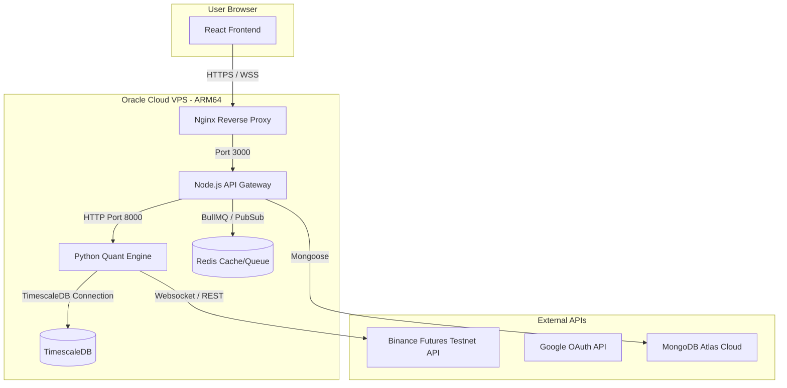

# Deployment Plan: Production Setup on Oracle Cloud Free Tier

This document outlines the step-by-step plan for deploying the Enma trading platform live to production using **Oracle Cloud Infrastructure (OCI) Always Free Tier**.

---

## Architecture Overview



---

## Step 1: Oracle Cloud VPS Setup

1. **Sign Up:** Register for the **Oracle Cloud Free Tier**.
2. **Create Compute Instance:**
   - **Name:** `enma-production`
   - **Image:** Ubuntu 24.04 (or 22.04) LTS.
   - **Shape:** `VM.Standard.A1.Flex` (ARM64 Ampere).
   - **Resources:** Allocate 2 to 4 OCPUs and 8 to 16 GB RAM (within the 24 GB / 4 OCPU always-free limit).
   - **SSH Keys:** Generate and download your private key.
3. **Configure Virtual Cloud Network (VCN):**
   - Go to your instance details -> click on the Subnet -> click on the Default Security List.
   - Add **Ingress Rules** to allow:
     - Port `80` (HTTP) from `0.0.0.0/0`
     - Port `443` (HTTPS) from `0.0.0.0/0`
     - Port `22` (SSH) from your IP address.

---

## Step 2: Set Up External Resources

### 1. MongoDB Atlas (Database)
* Create a free cluster on MongoDB Atlas.
* Whitelist the IP address of your Oracle VPS.
* Obtain the connection string (e.g., `mongodb+srv://...`).

### 3. Google Cloud Console (OAuth Sign-In)
* Create a project in Google Cloud Console.
* Go to **Credentials** -> Create OAuth 2.0 Client ID (Web Application).
* **Authorized Javascript Origins:** `https://yourdomain.com` (or your VPS public IP / DDNS).
* **Authorized Redirect URIs:** `https://yourdomain.com/api/v1/auth/google/callback`.
* Save the `GOOGLE_CLIENT_ID` and `GOOGLE_CLIENT_SECRET`.

---

## Step 3: VPS Environment Configuration

1. **SSH into the VPS:**
   ```bash
   ssh -i /path/to/key.key ubuntu@<YOUR_VPS_PUBLIC_IP>
   ```

2. **Update Packages & Install Docker:**
   ```bash
   sudo apt update && sudo apt upgrade -y
   sudo apt install -y docker.io docker-compose git certbot
   sudo systemctl enable --now docker
   ```

3. **Clone the Repository:**
   ```bash
   git clone <YOUR_REPOSITORY_URL> /opt/enma
   cd /opt/enma
   ```

4. **Configure Production `.env`:**
   Create `/opt/enma/.env` (using values tailored for production):
   ```env
   # General
   NODE_ENV=production
   PORT=3000
   CLIENT_URL=https://yourdomain.com
   SERVER_URL=https://yourdomain.com

   # MongoDB
   MONGO_URI=mongodb+srv://<user>:<password>@cluster.mongodb.net/enma

   # Google OAuth
   GOOGLE_CLIENT_ID=your-google-client-id
   GOOGLE_CLIENT_SECRET=your-google-client-secret
   ADMIN_EMAIL=your-admin-email@gmail.com
   JWT_SECRET=your-secure-random-jwt-secret
   ENCRYPTION_KEY=your-32-byte-hex-encryption-key

   # TimescaleDB (Self-hosted on the VPS via Docker)
   TIMESCALE_HOST=timescaledb
   TIMESCALE_PORT=5432
   TIMESCALE_USER=postgres
   TIMESCALE_PASSWORD=your-secure-postgres-password
   TIMESCALE_DB=enma_candles

   # Redis
   REDIS_HOST=redis
   REDIS_PORT=6379
   ```

---

## Step 4: Reverse Proxy & SSL (Nginx)

To secure the platform with HTTPS and allow WebSockets to pass through correctly, we use **Nginx** as a reverse proxy.

1. **Obtain SSL Certificate (Let's Encrypt):**
   ```bash
   sudo certbot certonly --standalone -d yourdomain.com
   ```
2. **Create Nginx Configuration:**
   Add a production `nginx.conf` template that routes:
   * `/` -> Static Frontend (can also be served directly by Nginx or built into Vercel).
   * `/api` and `/socket.io` -> Node.js Backend Server (`http://localhost:3000`).

---

## Step 5: Adjust Docker Compose for Production

Ensure the `docker-compose.yml` is set to auto-restart and bind correct production ports:
* Build `client` into static HTML/JS/CSS assets (if hosted on VPS) or point DNS for the client to **Vercel** and direct api calls to the VPS.
* Enable restart policies on all containers: `restart: unless-stopped`.

---

## Step 6: Deploy & Verify

1. **Build & Run the Stack:**
   ```bash
   docker-compose -f docker-compose.yml up -d --build
   ```
2. **Check Container Status:**
   ```bash
   docker-compose ps
   ```
3. **Verify Connection:**
   * Open `https://yourdomain.com` in your browser.
   * Verify "Sign in with Google" redirects to Google.
   * Verify you can authorize and access the dashboard.
   * Verify the WebSocket status badge shows connected.

---

## Important Considerations & Troubleshooting

### 1. ⚠️ Idle Instance Reclamation (Oracle's "Catch")
Oracle periodically shuts down or reclaims Always Free VMs that appear idle over a 7-day period. The instance is deemed idle if **CPU, network, and memory utilization (all three)** stay below 20% at the 95th percentile.

#### **Mitigation Script**
To prevent reclamation, you can set up a simple `cron` job on the VPS that runs a lightweight CPU utilization script periodically.
1. Create a script `/opt/enma/keep_alive.sh`:
   ```bash
   #!/bin/bash
   # Run a dummy benchmark calculation to generate brief CPU activity
   openssl speed -multi 2 > /dev/null 2>&1
   ```
2. Make it executable:
   ```bash
   chmod +x /opt/enma/keep_alive.sh
   ```
3. Add it to `crontab` to run every 6 hours:
   ```bash
   # Run crontab -e and add this line at the bottom:
   0 */6 * * * /opt/enma/keep_alive.sh
   ```

### 2. ⚠️ Out of Host Capacity Error
Because ARM64 resources are highly popular in Always Free regions (like Mumbai), you might see a `Temporary lack of host capacity` error when trying to provision the `VM.Standard.A1.Flex` shape.
* **Workaround:** Keep trying periodically, or check during off-peak hours (early morning/late night). Alternatively, if your region supports multiple Availability Domains, try switching the Availability Domain in the Placement section.

### 3. 🛡️ ARM64 (Aarch64) Compatibility
Since the instance runs on an Ampere Arm processor, all Docker containers must build and run on ARM64:
* Enma's default Node, Python, Redis, and TimescaleDB Docker images support ARM64 natively.
* The TA-Lib C library compilation during the Docker build process is compatible with ARM64 and will compile natively on the VPS during `docker-compose build`.

