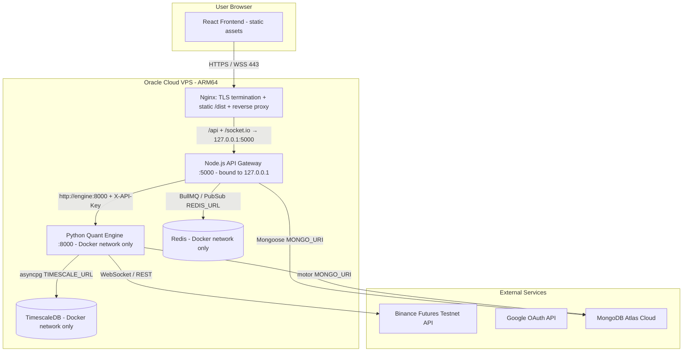
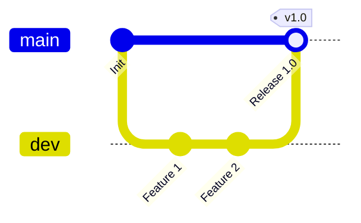

# Deployment Plan: Production Setup on Oracle Cloud Free Tier

Step-by-step plan for deploying the Enma trading platform to production on **Oracle Cloud Infrastructure (OCI) Always Free Tier** (ARM64 Ampere VPS), with Nginx TLS termination, MongoDB Atlas, and self-hosted TimescaleDB/Redis via Docker Compose.

**Every environment variable name in this document is verified against the code** (`server/src/**`, `engine/config/*`, `client/src/lib/*`). Do not substitute names from generic tutorials — the services read exactly these keys.

---

## Prerequisites (hard requirements — resolve before Step 1)

1. **Domain — done (2026-07-02): `enmaquant.duckdns.org`** (free DuckDNS subdomain). Google OAuth does not accept raw IP addresses as authorized origins, and an IP-only deployment would break login entirely. All commands below already use this domain.
2. **DNS record:** DuckDNS manages the A record — **after the VPS exists, update the IP at <https://www.duckdns.org> to the VPS public IP** (at claim time it auto-filled the home ISP IP, which is wrong for deployment). Must be done before the certbot step. Assign a **reserved public IP** to the OCI instance (free) so the IP survives instance stop/start and the DNS entry never goes stale. Ignore DuckDNS's "ipv6 address was already not updated" notice — IPv6 is unused.
3. **Code changes on `dev` before deploying** — see [Pre-Deploy Code Changes](#pre-deploy-code-changes-required). The plan assumes these are merged.

---

## Architecture Overview



Exposure policy:
- **Nginx** is the only process listening on public ports (80/443).
- **Server** binds `127.0.0.1:5000` on the host — reachable by Nginx, not the internet.
- **Engine, Redis, TimescaleDB** publish no host ports at all — Docker-network only. The engine's `X-API-Key` auth is defense-in-depth, not the perimeter.

---

## Step 1: Oracle Cloud VPS Setup

1. **Sign up** for the Oracle Cloud Free Tier.
2. **Create Compute Instance:**
   - **Name:** `enma-production`
   - **Image:** Ubuntu 24.04 LTS (aarch64).
   - **Shape:** `VM.Standard.A1.Flex` (ARM64 Ampere).
   - **Resources:** 4 OCPUs / 24 GB RAM (use the full always-free allotment — see the idle-reclamation note; being one large VM also helps utilization stay above reclaim thresholds).
   - **SSH Keys:** generate and download the private key.
3. **Configure the VCN Security List** (instance → Subnet → Default Security List → Ingress Rules):
   - Port `80` (TCP) from `0.0.0.0/0`
   - Port `443` (TCP) from `0.0.0.0/0`
   - Port `22` (TCP) from your IP only.

> [!WARNING]
> **Oracle's Ubuntu images ship with restrictive host-level iptables rules** (`/etc/iptables/rules.v4`) that REJECT everything except SSH — the cloud Security List alone is NOT enough. After SSH-ing in (Step 3), open 80/443 at the host too:
> ```bash
> sudo iptables -I INPUT 6 -m state --state NEW -p tcp --dport 80 -j ACCEPT
> sudo iptables -I INPUT 6 -m state --state NEW -p tcp --dport 443 -j ACCEPT
> sudo netfilter-persistent save
> ```
> **`-I INPUT 6` is not reliably "before the REJECT rule"** — the exact chain layout varies (confirmed
> on a real deploy: after an OS upgrade the catch-all REJECT had shifted to position 5, so inserting
> at 6 landed *after* it and the ACCEPT rules were silently dead). Always verify afterward:
> ```bash
> sudo iptables -L INPUT -n --line-numbers
> ```
> The 80/443 ACCEPT lines must appear *above* any REJECT/DROP line. If not, delete and re-insert at
> the correct position (one before the REJECT line), then re-run `netfilter-persistent save`.
> Symptom if skipped: Security List looks correct but curl to the public IP times out.

---

## Step 2: Set Up External Resources

### 2.1 MongoDB Atlas (Metadata DB)

* Create a free **M0** cluster.
* **Network Access:** whitelist the VPS public IP (avoid `0.0.0.0/0`).
* Create a database user; note the connection string (`mongodb+srv://...`).
* The database name is `enma_trading` (matches `MONGO_DB` below).

### 2.2 Google Cloud Console (OAuth Sign-In)

* Create a project → **Credentials** → OAuth 2.0 Client ID (Web application).
* **Authorized JavaScript origins:** `https://enmaquant.duckdns.org`
* **Authorized redirect URIs:** `https://enmaquant.duckdns.org/api/v1/auth/google/callback`
  (This exact path is hardcoded in `server/src/routes/auth.routes.js`; the base URL is supplied via `GOOGLE_CALLBACK_URL` — see Step 4.)
* Save `GOOGLE_CLIENT_ID` and `GOOGLE_CLIENT_SECRET`.
* **If the OAuth client already exists** (created with localhost/dev origins), don't create a new one — edit it and add the production origin + redirect URI above alongside the dev entries.

---

## Step 3: VPS Base Setup

1. **SSH in:**
   ```bash
   ssh -i /path/to/key.key ubuntu@<VPS_PUBLIC_IP>
   ```

2. **Open host firewall for 80/443** (see the warning in Step 1 — do it now).

3. **Install Docker (with Compose v2), Nginx, Certbot:**
   ```bash
   sudo apt update && sudo apt upgrade -y
   sudo apt install -y docker.io docker-compose-v2 nginx certbot python3-certbot-nginx git
   sudo systemctl enable --now docker nginx
   sudo usermod -aG docker ubuntu   # re-login for this to take effect
   ```
   > Use the `docker compose` (v2 plugin) syntax throughout — not the legacy `docker-compose` v1 binary.

4. **Clone the repository.** This assumes a public HTTPS-cloneable repo. **If the repo is private**
   (confirmed the case on a real deploy — a bare `git clone https://...` fails with
   `fatal: could not read Username for 'https://github.com': No such device or address`), set up a
   read-only SSH deploy key instead:
   ```bash
   # On the VPS, as ubuntu (not root):
   ssh-keygen -t ed25519 -f ~/.ssh/enma_deploy_key -N '' -C 'enma-vps-deploy'
   cat ~/.ssh/enma_deploy_key.pub   # copy this
   printf 'Host github.com\n  IdentityFile ~/.ssh/enma_deploy_key\n  IdentitiesOnly yes\n' >> ~/.ssh/config
   chmod 600 ~/.ssh/config
   ssh -o StrictHostKeyChecking=accept-new -T git@github.com   # accept host key, confirm auth
   ```
   Register the public key as a **read-only** Deploy Key on the repo — either via the GitHub web UI
   (repo → Settings → Deploy keys → Add deploy key, leave "Allow write access" unchecked), or from
   your local machine with the `gh` CLI already authenticated:
   ```bash
   gh repo deploy-key add - --repo <owner>/<repo> --title "enma-vps-deploy" <<< "<paste pubkey>"
   ```
   Then clone as `ubuntu` (not `sudo`/root — root doesn't have the `ubuntu` user's SSH config):
   ```bash
   sudo mkdir -p /opt/enma && sudo chown ubuntu:ubuntu /opt/enma
   git clone git@github.com:<owner>/<repo>.git /opt/enma
   cd /opt/enma && git checkout main
   git config core.sshCommand 'ssh -i ~/.ssh/enma_deploy_key -o IdentitiesOnly=yes'
   ```
   **If the repo is public**, the simpler original form still works:
   ```bash
   sudo git clone <YOUR_REPOSITORY_URL> /opt/enma
   sudo chown -R ubuntu:ubuntu /opt/enma
   cd /opt/enma
   git checkout main
   ```

---

## Step 4: Production `.env`

Create `/opt/enma/.env` (git-ignored; both `server` and `engine` containers load it via `env_file`, and Compose uses it for `${...}` interpolation in the YAML).

> [!IMPORTANT]
> **`SERVER_URL` vs `GOOGLE_CALLBACK_URL` — do not "fix" this to the public domain.**
> `SERVER_URL` is read by the **engine** (`engine/core/live_bot_manager.py`, `engine/scripts/chaos_runner.py`) to call the Node server's internal callback routes over the Docker network — it must stay `http://server:5000`. The public OAuth callback is configured separately via `GOOGLE_CALLBACK_URL`, which `server/src/config/passport.js` reads with priority over `SERVER_URL`.

```env
# ── Runtime ──────────────────────────────────────
NODE_ENV=production
PYTHON_ENV=production
PORT=5000

# ── URLs ─────────────────────────────────────────
# Public origin of the app (CORS + post-login redirect)
CLIENT_URL=https://enmaquant.duckdns.org
# INTERNAL Docker-network URL of the Node server (used by engine) — do NOT set to the domain
SERVER_URL=http://server:5000
# Public OAuth callback (overrides the SERVER_URL-derived default in passport.js)
GOOGLE_CALLBACK_URL=https://enmaquant.duckdns.org/api/v1/auth/google/callback
# Internal Docker-network URL of the Python engine (used by server)
ENGINE_URL=http://engine:8000

# ── Auth & Secrets ───────────────────────────────
GOOGLE_CLIENT_ID=your-google-client-id
GOOGLE_CLIENT_SECRET=your-google-client-secret
ADMIN_EMAIL=your-admin-email@gmail.com
JWT_SECRET=<64-char random string: openssl rand -hex 32>
JWT_EXPIRES_IN=7d
JWT_REFRESH_EXPIRES_IN=30d
ENCRYPTION_KEY=<EXACTLY 32 chars: openssl rand -hex 16 — encryption.js requires a 32-byte utf8 string; a 64-char value silently falls back to the insecure dev key>
# Shared secret between server and engine (X-API-Key header)
ENGINE_API_KEY=<random string: openssl rand -hex 24>

# ── MongoDB Atlas ────────────────────────────────
MONGO_URI=mongodb+srv://<user>:<password>@cluster.mongodb.net/enma_trading
MONGO_DB=enma_trading

# ── TimescaleDB (self-hosted container) ──────────
# Single DSN — the engine reads TIMESCALE_URL, not discrete HOST/USER/PASSWORD vars
TIMESCALE_PASSWORD=<strong password>
TIMESCALE_URL=postgresql://enma:<same strong password>@timescaledb:5432/enma_candles

# ── Redis ────────────────────────────────────────
# Both server and engine read REDIS_URL (not REDIS_HOST/REDIS_PORT)
REDIS_URL=redis://redis:6379

# ── Binance ──────────────────────────────────────
# Intentionally unset in production — each user adds their own keys via the Settings
# page (stored AES-encrypted in Mongo). The only env consumer is reconciliation.js,
# which uses them at startup to force-close orphaned positions; without them it
# safely skips that (sessions are still marked stopped and locks released, but a
# position left open on Binance after a crash must be closed manually).
# BINANCE_TESTNET_API_KEY=
# BINANCE_TESTNET_SECRET=
BINANCE_TESTNET=true
BINANCE_FETCH_DELAY_MS=200
```

Variable-to-consumer map (for auditing):

| Variable | Read by |
|---|---|
| `PORT`, `MONGO_URI`, `ADMIN_EMAIL` | `server/src/server.js`, `passport.js`, `admin.controller.js` |
| `CLIENT_URL` | server CORS (`app.js`), Socket.IO (`config/socket.js`), OAuth redirects (`auth.controller.js`), engine CORS (`main.py`) |
| `SERVER_URL` | engine → server internal callbacks (`live_bot_manager.py`) |
| `GOOGLE_CALLBACK_URL` | `server/src/config/passport.js` (takes priority over `SERVER_URL`) |
| `ENGINE_URL`, `ENGINE_API_KEY` | `server/src/services/engineClient.js` → validated in `engine/main.py` |
| `REDIS_URL` | `server/src/config/redis.js`, `socketEmitter.js`, engine `services/progress.py`, `backtest_runner.py` |
| `TIMESCALE_URL` | `engine/config/timescale.py` (asyncpg DSN) |
| `MONGO_URI` + `MONGO_DB` | `engine/config/mongo.py` (motor) |
| `JWT_SECRET`, `JWT_EXPIRES_IN` | `auth.controller.js`, `auth.middleware.js`, `config/socket.js` |
| `ENCRYPTION_KEY` | `server/src/utils/encryption.js` (AES for Binance keys) |

---

## Step 5: Build the Client (static assets)

The client container is **not** run in production. Host Nginx serves the compiled bundle from `/opt/enma/client/dist`.

Vite bakes `VITE_API_URL` / `VITE_SOCKET_URL` into the bundle at build time from `client/.env.production` (tracked in git — see Pre-Deploy Code Changes). Build with a throwaway Node container so the VPS never needs a host Node install:

```bash
cd /opt/enma
docker run --rm -v /opt/enma/client:/app -w /app node:20-alpine \
  sh -c "npm ci && npm run build"
```

This produces `/opt/enma/client/dist`. Re-run this command on every release that touches `client/`.

---

## Step 6: Nginx Reverse Proxy + TLS

1. **Create `/etc/nginx/sites-available/enma`** (HTTP-only first; certbot upgrades it):
   ```nginx
   server {
       listen 80;
       server_name enmaquant.duckdns.org;

       # Compiled static client
       root /opt/enma/client/dist;
       index index.html;

       location / {
           try_files $uri $uri/ /index.html;
       }

       # Node.js API Gateway
       location /api {
           proxy_pass http://127.0.0.1:5000;
           proxy_http_version 1.1;
           proxy_set_header Host $host;
           proxy_set_header X-Real-IP $remote_addr;
           proxy_set_header X-Forwarded-For $proxy_add_x_forwarded_for;
           proxy_set_header X-Forwarded-Proto $scheme;
       }

       # Socket.IO (WebSocket upgrade)
       location /socket.io/ {
           proxy_pass http://127.0.0.1:5000/socket.io/;
           proxy_http_version 1.1;
           proxy_set_header Upgrade $http_upgrade;
           proxy_set_header Connection "Upgrade";
           proxy_set_header Host $host;
           proxy_set_header X-Real-IP $remote_addr;
           proxy_set_header X-Forwarded-For $proxy_add_x_forwarded_for;
           proxy_set_header X-Forwarded-Proto $scheme;
           proxy_read_timeout 86400;   # keep long-lived WS connections alive
       }
   }
   ```

2. **Enable and validate:**
   ```bash
   sudo ln -s /etc/nginx/sites-available/enma /etc/nginx/sites-enabled/
   sudo rm -f /etc/nginx/sites-enabled/default
   sudo nginx -t && sudo systemctl reload nginx
   ```

3. **Hard-verify port 80 is reachable from the public internet before running certbot — don't
   assume the Step 1 Security List rule "took" just because it was added once.** Confirmed on a
   real deploy: the Security List page can silently save only one of the two rules (80 saved, 443
   didn't, in a single "Add Ingress Rules" session with both filled in) — host iptables being
   correct is not enough if the cloud-level Security List rule is missing. From any machine
   *outside* the VPS:
   ```bash
   curl -s -o /dev/null -w "%{http_code}\n" http://<VPS_PUBLIC_IP_OR_DOMAIN>/ --max-time 15
   ```
   Must return `200` (or a redirect code), not a timeout. If it times out, go back to the OCI
   console → instance → Networking → subnet → Security rules → confirm a TCP/80 ingress rule from
   `0.0.0.0/0` actually exists (not just that you clicked Save once) — re-add it if missing, and
   also add the TCP/443 rule now (certbot's redirect will need it moments later; add both in this
   pass instead of writing it and testing 443 for you now — it's the same class of bug and cheaper
   to fix once).

4. **Obtain the certificate with the nginx plugin** (edits the config in place, adds the 443 server block + HTTP→HTTPS redirect, and installs auto-renewal that works while nginx is running — do not use `--standalone`, its renewals conflict with nginx on port 80):
   ```bash
   sudo certbot --nginx -d enmaquant.duckdns.org
   ```

5. **Verify auto-renewal:**
   ```bash
   sudo certbot renew --dry-run
   ```

---

## Step 7: Production Docker Compose

Create `docker-compose.prod.yml` at the repo root (tracked in git — see Pre-Deploy Code Changes). Key differences from the dev compose:

- `command:` overrides put server/engine in **production mode** — the checked-in Dockerfiles' CMDs are dev-mode (`nodemon`, `uvicorn --reload`, `npm install` on every start) and must not run in prod.
- **Healthchecks are defined for every service** — `depends_on: condition: service_healthy` is invalid without them (Compose refuses to start).
- Server binds `127.0.0.1` only; engine/redis/timescaledb publish **no host ports**.
- A named volume persists `engine/strategies/` so user-created strategy files survive image rebuilds (the volume seeds itself from the image on first run; the startup seeder only adds missing strategies).

```yaml
services:
  redis:
    image: redis:7-alpine
    restart: unless-stopped
    volumes:
      - enma_redis_data:/data
    healthcheck:
      test: ["CMD", "redis-cli", "ping"]
      interval: 10s
      timeout: 5s
      retries: 5
      start_period: 5s

  timescaledb:
    image: timescale/timescaledb:latest-pg16
    restart: unless-stopped
    environment:
      POSTGRES_DB: enma_candles
      POSTGRES_USER: enma
      POSTGRES_PASSWORD: ${TIMESCALE_PASSWORD}
    volumes:
      - enma_timescale_data:/var/lib/postgresql/data
      - ./docker/timescale/init.sql:/docker-entrypoint-initdb.d/init.sql
    healthcheck:
      test: ["CMD-SHELL", "pg_isready -U enma -d enma_candles"]
      interval: 10s
      timeout: 5s
      retries: 5
      start_period: 15s

  engine:
    build: ./engine
    restart: unless-stopped
    command: ["uvicorn", "main:app", "--host", "0.0.0.0", "--port", "8000"]
    env_file:
      - ./.env
    volumes:
      - enma_engine_strategies:/app/strategies
    depends_on:
      timescaledb:
        condition: service_healthy
      redis:
        condition: service_healthy
    healthcheck:
      test: ["CMD", "curl", "-f", "http://localhost:8000/health"]
      interval: 15s
      timeout: 5s
      retries: 3
      start_period: 30s

  server:
    build: ./server
    restart: unless-stopped
    command: ["node", "src/server.js"]
    ports:
      - "127.0.0.1:5000:5000"
    env_file:
      - ./.env
    depends_on:
      redis:
        condition: service_healthy
      engine:
        condition: service_healthy
    healthcheck:
      test: ["CMD", "curl", "-f", "http://localhost:5000/api/v1/health"]
      interval: 15s
      timeout: 5s
      retries: 3
      start_period: 20s

volumes:
  enma_redis_data:
  enma_timescale_data:
  enma_engine_strategies:
```

> [!NOTE]
> **Docker publishes ports via its own iptables chain, bypassing UFW/host INPUT rules.** A `ports: "8000:8000"` line would expose the engine to the internet regardless of firewall settings (the OCI Security List would still block it, but don't rely on a single layer). This is why only the server maps a port, and only on `127.0.0.1`.

---

## Step 8: Deploy & Verify

1. **Build & start** (TA-Lib compiles from source on first engine build — 3–5 min on ARM is expected):
   ```bash
   cd /opt/enma
   docker compose -f docker-compose.prod.yml up -d --build
   ```

2. **Verification checklist:**
   ```bash
   docker compose -f docker-compose.prod.yml ps          # all services "healthy"
   curl -s http://127.0.0.1:5000/api/v1/health           # {"status":"ok","mongo":"connected","redis":"connected"}
   curl -s https://enmaquant.duckdns.org/api/v1/health          # same, via nginx
   ```
   Then in the browser:
   - `https://enmaquant.duckdns.org` loads the login page.
   - Sign in with the `ADMIN_EMAIL` Google account (the admin email is auto-provisioned by the server startup; other users must first be added under `/admin` → allowed emails).
   - Dashboard loads; Socket.IO status badges show connected (emerald).
   - `/admin` panel is reachable for the admin account.
   - Run a small backtest end-to-end (exercises engine → TimescaleDB candle fetch → Redis progress → Socket.IO relay).

---

## Pre-Deploy Code Changes Required

> **Status: all four items below are implemented on `dev`, and `client/.env.production`
> now carries the real domain (`enmaquant.duckdns.org`) — no code-side work remains.**

1. **`server/src/app.js` — trust the proxy.** Add `app.set('trust proxy', 1)` right after `const app = express()`. Behind Nginx, `express-rate-limit` v7 errors on the `X-Forwarded-For` header without this, and `req.ip` would otherwise log Nginx's address for every client.

2. **Create `client/.env.production`** (tracked in git — the root `.gitignore`'s `.env` pattern does not match it):
   ```env
   VITE_API_URL=https://enmaquant.duckdns.org
   VITE_SOCKET_URL=https://enmaquant.duckdns.org
   ```
   Vite's mode-specific files take priority over plain `.env`, so the git-ignored `client/.env` (localhost values) keeps working for `npm run dev` while `npm run build` picks up production values.

3. **Create `docker-compose.prod.yml`** at the repo root with the content from Step 7 (tracked in git).

4. **Update root `.env.example`** to include the auth-era keys that are currently missing (`GOOGLE_CLIENT_ID`, `GOOGLE_CLIENT_SECRET`, `GOOGLE_CALLBACK_URL`, `ADMIN_EMAIL`, `ENCRYPTION_KEY`, `JWT_EXPIRES_IN`, `JWT_REFRESH_EXPIRES_IN`), so the example file stays the canonical key list.

---

## Release / Update Workflow

> **One-time prerequisite on any machine that will run `git merge dev` into `main`:**
> ```bash
> git config merge.ours.driver true
> ```
> `main` intentionally lacks `.claude/`, `AGENTS.md`, all `CLAUDE.md` files, and `workspace/` (see
> [Cross-Branch Environment & URL Management](#cross-branch-environment--url-management-best-practices)
> below) — `.gitattributes` marks those paths `merge=ours` so a `dev` → `main` merge keeps main's
> deletion instead of resurrecting them or hitting a modify/delete conflict. That attribute is
> useless without this local config registering the `ours` driver — **without it, the merge below
> will conflict** the moment `dev` has touched any of those paths since the branches last synced
> (which is often, since `workspace/plan/handoff.md` gets edited most sessions).

```bash
# On your machine: promote a release
git checkout main && git merge dev && git push origin main

# On the VPS:
cd /opt/enma
git pull origin main
docker compose -f docker-compose.prod.yml up -d --build   # rebuild server/engine
# Only if client/ changed in this release:
docker run --rm -v /opt/enma/client:/app -w /app node:20-alpine sh -c "npm ci && npm run build"
```

Rollback: `git checkout <previous-tag-or-sha>` then re-run the same two build commands. Tag releases (`git tag v1.x`) to make this trivial.

**Data safety across updates:** Timescale candles and Redis queues live in named volumes; Mongo lives in Atlas. `docker compose up --build` does not touch volumes. Never run `docker compose down -v` on the VPS (it deletes the candle store).

---

## Important Considerations & Troubleshooting

### 1. ⚠️ Idle Instance Reclamation (Oracle's "Catch")

Oracle reclaims Always Free VMs deemed idle over a 7-day window — idle means CPU, network, **and** memory all below thresholds (~20% at 95th percentile). A running Enma stack (engine WebSocket streams, Redis, TimescaleDB) generates steady baseline activity, but as insurance add a cron job:

```bash
cat <<'EOF' | sudo tee /opt/enma/keep_alive.sh
#!/bin/bash
# Brief CPU burst so 95th-percentile utilization stays above Oracle's idle threshold
openssl speed -multi 2 > /dev/null 2>&1
EOF
sudo chmod +x /opt/enma/keep_alive.sh
# crontab -e → add:
# 0 */6 * * * /opt/enma/keep_alive.sh
```

Upgrading the account to Pay-As-You-Go (still $0 within always-free limits, but requires a card) permanently exempts the instance from idle reclamation — the more reliable fix.

### 2. ⚠️ "Out of Host Capacity" When Provisioning

ARM shapes in popular regions (e.g. Mumbai) frequently show `Out of host capacity` for `VM.Standard.A1.Flex`. Workarounds: retry at off-peak hours, try a different Availability Domain, or upgrade to Pay-As-You-Go (paid-tier customers get priority on capacity even when usage stays within free limits).

### 3. 🛡️ ARM64 (aarch64) Compatibility

All images used here publish ARM64 variants: `node:20-alpine`, `python:3.11-slim`, `redis:7-alpine`, `timescale/timescaledb:latest-pg16`. **TA-Lib does *not* build out of the box on aarch64** — `ta-lib-0.4.0-src.tar.gz`'s bundled `config.guess`/`config.sub` predate aarch64 and `./configure` fails with `cannot guess build type` (confirmed on a real ARM64 deploy). `engine/Dockerfile` already downloads fresh `config.guess`/`config.sub` from the GNU config project before `./configure` to fix this — no action needed *because that fix is already baked in*, not because TA-Lib is naturally ARM64-clean.

### 4. 🔐 Layered Firewall Summary

| Layer | Controls | Configured in |
|---|---|---|
| OCI Security List | 22/80/443 from internet | Cloud console (Step 1) |
| Host iptables | Same — Oracle images REJECT by default | Step 3 (netfilter-persistent) |
| Docker port bindings | Only `127.0.0.1:5000` published | `docker-compose.prod.yml` |

Remember: Docker-published ports bypass host INPUT rules — the compose file's bindings are themselves a firewall decision.

---

## Cross-Branch Environment & URL Management (Best Practices)

Keeps `dev` and `main`'s **application code and config** identical so releases are pure merges —
no environment-specific find-and-replace, ever. **This is no longer true of the full file tree**:
as of 2026-07-02, `main` intentionally lacks `.claude/`, `AGENTS.md`, every `CLAUDE.md`, and
`workspace/` — see §0 below. The invariant now applies specifically to everything that ships to
production (`server/`, `client/`, `engine/`, root config files), not to AI-agent tooling or
planning docs, which only ever need to exist on `dev`.

### 0. Doc/Tooling Divergence Between `dev` and `main` (intentional)

`.claude/`, `AGENTS.md`, all `CLAUDE.md` files, and `workspace/` (docs, plans, archive) are used
only by AI coding agents during development — nothing in `server/`, `client/`, or `engine/` reads
them at runtime, and the VPS has no use for them. They exist on `dev` (agents need them every
session) and are permanently absent from `main`.

Mechanism: `.gitattributes` on `main` marks these exact paths `merge=ours`. Combined with the local
`git config merge.ours.driver true` (see [Release / Update Workflow](#release--update-workflow)
above), a `dev` → `main` merge keeps main's deletion automatically — no conflict, no resurrection —
even though `dev` keeps editing `workspace/plan/handoff.md`. **This local config does not travel
with the repo** — if release merges are ever done from a different machine, that config must be set
there too, or the merge will hit modify/delete conflicts on these paths instead of silently doing
the right thing.

If `main` is ever the clone target for onboarding a new contributor, they will be missing all
architecture/API/strategy docs by design (currently moot — single-user project, per `CLAUDE.md`'s
`Single-user platform` rule, which itself only exists on `dev`).

### 1. The Single-Codebase Invariant (12-Factor)

No hardcoded URLs, ports, or credentials in source. All configuration comes from environment variables — runtime for Node/Python, build-time for Vite. `dev` merges into `main` with zero config-related conflicts.

### 2. Vite Build-Time Injection

The browser can't read server-side env vars, so Vite bakes `VITE_`-prefixed values in at build time:

- Code always uses `import.meta.env.VITE_API_URL` / `VITE_SOCKET_URL` (already the case — `client/src/lib/axios.js`, `client/src/lib/socket.js`).
- `client/.env` (git-ignored) holds localhost values for `npm run dev`.
- `client/.env.production` (tracked) holds the public domain for `npm run build` — mode-specific files override plain `.env`.

### 3. Server-Side Runtime Variables

- **Dev:** git-ignored root `.env` with Docker-service-name hosts (`redis`, `timescaledb`, `engine`) and dev Google credentials.
- **Prod:** git-ignored `/opt/enma/.env` (Step 4) with Atlas URI and production secrets.
- **Contract:** root `.env.example` (tracked) lists every required key with no values — it is the single source of truth for "what must be set."

### 4. Branch Promotion Workflow



1. Features branch from `dev`, merge back into `dev`.
2. Release = merge `dev` → `main`, tag it. Requires `git config merge.ours.driver true` set locally
   first (see [Release / Update Workflow](#release--update-workflow)) so the doc/tooling paths
   (§0 above) don't conflict or resurrect during the merge.
3. VPS pulls `main`, rebuilds containers, rebuilds the client bundle (Step 5 command) if `client/` changed.
