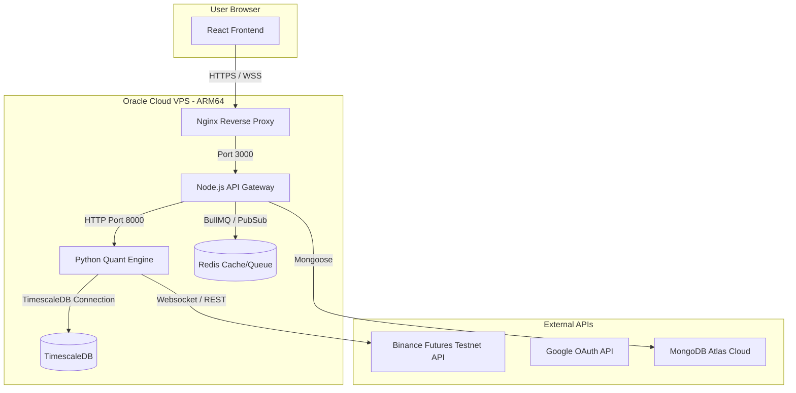
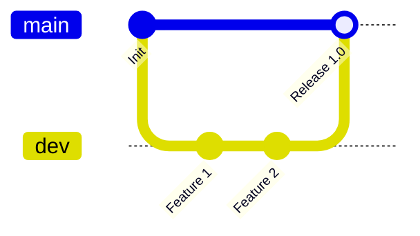

# Deployment Plan: Production Setup on Oracle Cloud Free Tier

This document outlines the step-by-step plan for deploying the Enma trading platform live to production using **Oracle Cloud Infrastructure (OCI) Always Free Tier**.

---

## Architecture Overview



---

## Step 1: Oracle Cloud VPS Setup

1. **Sign Up:** Register for the **Oracle Cloud Free Tier**.
2. **Create Compute Instance:**
   - **Name:** `enma-production`
   - **Image:** Ubuntu 24.04 (or 22.04) LTS.
   - **Shape:** `VM.Standard.A1.Flex` (ARM64 Ampere).
   - **Resources:** Allocate 2 to 4 OCPUs and 8 to 16 GB RAM (within the 24 GB / 4 OCPU always-free limit).
   - **SSH Keys:** Generate and download your private key.
3. **Configure Virtual Cloud Network (VCN):**
   - Go to your instance details -> click on the Subnet -> click on the Default Security List.
   - Add **Ingress Rules** to allow:
     - Port `80` (HTTP) from `0.0.0.0/0`
     - Port `443` (HTTPS) from `0.0.0.0/0`
     - Port `22` (SSH) from your IP address.

---

## Step 2: Set Up External Resources

### 1. MongoDB Atlas (Database)
* Create a free cluster on MongoDB Atlas.
* Whitelist the IP address of your Oracle VPS.
* Obtain the connection string (e.g., `mongodb+srv://...`).

### 3. Google Cloud Console (OAuth Sign-In)
* Create a project in Google Cloud Console.
* Go to **Credentials** -> Create OAuth 2.0 Client ID (Web Application).
* **Authorized Javascript Origins:** `https://yourdomain.com` (or your VPS public IP / DDNS).
* **Authorized Redirect URIs:** `https://yourdomain.com/api/v1/auth/google/callback`.
* Save the `GOOGLE_CLIENT_ID` and `GOOGLE_CLIENT_SECRET`.

---

## Step 3: VPS Environment Configuration

1. **SSH into the VPS:**
   ```bash
   ssh -i /path/to/key.key ubuntu@<YOUR_VPS_PUBLIC_IP>
   ```

2. **Update Packages & Install Docker:**
   ```bash
   sudo apt update && sudo apt upgrade -y
   sudo apt install -y docker.io docker-compose git certbot
   sudo systemctl enable --now docker
   ```

3. **Clone the Repository:**
   ```bash
   git clone <YOUR_REPOSITORY_URL> /opt/enma
   cd /opt/enma
   ```

4. **Configure Production `.env`:**
   Create `/opt/enma/.env` (using values tailored for production):
   ```env
   # General
   NODE_ENV=production
   PORT=5000
   CLIENT_URL=https://yourdomain.com
   SERVER_URL=https://yourdomain.com

   # MongoDB
   MONGO_URI=mongodb+srv://<user>:<password>@cluster.mongodb.net/enma

   # Google OAuth
   GOOGLE_CLIENT_ID=your-google-client-id
   GOOGLE_CLIENT_SECRET=your-google-client-secret
   ADMIN_EMAIL=your-admin-email@gmail.com
   JWT_SECRET=your-secure-random-jwt-secret
   ENCRYPTION_KEY=your-32-byte-hex-encryption-key

   # TimescaleDB (Self-hosted on the VPS via Docker)
   TIMESCALE_HOST=timescaledb
   TIMESCALE_PORT=5432
   TIMESCALE_USER=enma
   TIMESCALE_PASSWORD=your-secure-postgres-password
   TIMESCALE_DB=enma_candles

   # Redis
   REDIS_HOST=redis
   REDIS_PORT=6379

   # Client Build-time APIs (passed to Vite)
   VITE_API_URL=https://yourdomain.com
   VITE_SOCKET_URL=https://yourdomain.com
   ```

---

## Step 4: Reverse Proxy & SSL (Nginx)

To secure the platform with HTTPS and allow WebSockets to pass through correctly, we use **Nginx** as a reverse proxy.

1. **Obtain SSL Certificate (Let's Encrypt):**
   ```bash
   sudo certbot certonly --standalone -d yourdomain.com
   ```

2. **Create Nginx Configuration (`/etc/nginx/sites-available/enma`):**
   Configure Nginx to terminate SSL, serve client static assets directly for maximum efficiency, and proxy API/Socket requests:
   ```nginx
   server {
       listen 80;
       server_name yourdomain.com;
       return 301 https://$host$request_uri;
   }

   server {
       listen 443 ssl;
       server_name yourdomain.com;

       ssl_certificate /etc/letsencrypt/live/yourdomain.com/fullchain.pem;
       ssl_certificate_key /etc/letsencrypt/live/yourdomain.com/privkey.pem;
       ssl_protocols TLSv1.2 TLSv1.3;
       ssl_ciphers HIGH:!aNULL:!MD5;

       # Serve compiled static assets
       location / {
           root /opt/enma/client/dist;
           index index.html;
           try_files $uri $uri/ /index.html;
       }

       # Node.js API Gateway
       location /api {
           proxy_pass http://localhost:5000;
           proxy_http_version 1.1;
           proxy_set_header Upgrade $http_upgrade;
           proxy_set_header Connection 'upgrade';
           proxy_set_header Host $host;
           proxy_cache_bypass $http_upgrade;
           proxy_set_header X-Real-IP $remote_addr;
           proxy_set_header X-Forwarded-For $proxy_add_x_forwarded_for;
       }

       # Socket.IO Handshake & Connection
       location /socket.io/ {
           proxy_pass http://localhost:5000/socket.io/;
           proxy_http_version 1.1;
           proxy_set_header Upgrade $http_upgrade;
           proxy_set_header Connection "Upgrade";
           proxy_set_header Host $host;
           proxy_set_header X-Real-IP $remote_addr;
           proxy_set_header X-Forwarded-For $proxy_add_x_forwarded_for;
       }
   }
   ```
   Enable the site configuration and reload Nginx:
   ```bash
   sudo ln -s /etc/nginx/sites-available/enma /etc/nginx/sites-enabled/
   sudo systemctl reload nginx
   ```

---

## Step 5: Production Docker Configuration

To optimize CPU and memory footprint on ARM64 VMs:
1. **Serve Static Client via Host Nginx (Recommended)**:
   In production, we do not run the client container. We build the client assets once on the VPS and let the host Nginx serve them directly:
   ```bash
   cd /opt/enma/client
   npm install
   npm run build
   ```
   This generates the `/opt/enma/client/dist` static directory referenced by Nginx.

2. **Configure `docker-compose.prod.yml`**:
   For running server, engine, redis, and timescaledb in background mode, configure a production-specific file:
   ```yaml
   version: "3.9"

   services:
     redis:
       image: redis:7-alpine
       restart: unless-stopped
       volumes:
         - enma_redis_data:/data

     timescaledb:
       image: timescale/timescaledb:latest-pg16
       restart: unless-stopped
       environment:
         POSTGRES_DB: enma_candles
         POSTGRES_USER: enma
         POSTGRES_PASSWORD: your-secure-postgres-password
       volumes:
         - enma_timescale_data:/var/lib/postgresql/data
         - ./docker/timescale/init.sql:/docker-entrypoint-initdb.d/init.sql

     engine:
       build: ./engine
       restart: unless-stopped
       ports:
         - "8000:8000"
       env_file:
         - .env
       depends_on:
         timescaledb:
           condition: service_healthy
         redis:
           condition: service_healthy

     server:
       build: ./server
       restart: unless-stopped
       ports:
         - "5000:5000"
       env_file:
         - .env
       depends_on:
         redis:
           condition: service_healthy
         engine:
           condition: service_healthy

   volumes:
     enma_redis_data:
     enma_timescale_data:
   ```

---

## Step 6: Deploy & Verify

1. **Build & Run the Stack:**
   ```bash
   docker-compose -f docker-compose.prod.yml up -d --build
   ```
2. **Check Container Status:**
   ```bash
   docker-compose -f docker-compose.prod.yml ps
   ```
3. **Verify Connection:**
   * Open `https://yourdomain.com` in your browser.
   * Verify redirect to Google login works.
   * Whitelist your admin/user email inside MongoDB Atlas or via the `/admin` view.
   * Verify you can authorize and load the dashboard.
   * Verify all Socket.IO status badges display connected green status.

---

## Important Considerations & Troubleshooting

### 1. ⚠️ Idle Instance Reclamation (Oracle's "Catch")
Oracle periodically shuts down or reclaims Always Free VMs that appear idle over a 7-day period. The instance is deemed idle if **CPU, network, and memory utilization (all three)** stay below 20% at the 95th percentile.

#### **Mitigation Script**
To prevent reclamation, you can set up a simple `cron` job on the VPS that runs a lightweight CPU utilization script periodically.
1. Create a script `/opt/enma/keep_alive.sh`:
   ```bash
   #!/bin/bash
   # Run a dummy benchmark calculation to generate brief CPU activity
   openssl speed -multi 2 > /dev/null 2>&1
   ```
2. Make it executable:
   ```bash
   chmod +x /opt/enma/keep_alive.sh
   ```
3. Add it to `crontab` to run every 6 hours:
   ```bash
   # Run crontab -e and add this line at the bottom:
   0 */6 * * * /opt/enma/keep_alive.sh
   ```

### 2. ⚠️ Out of Host Capacity Error
Because ARM64 resources are highly popular in Always Free regions (like Mumbai), you might see a `Temporary lack of host capacity` error when trying to provision the `VM.Standard.A1.Flex` shape.
* **Workaround:** Keep trying periodically, or check during off-peak hours (early morning/late night). Alternatively, if your region supports multiple Availability Domains, try switching the Availability Domain in the Placement section.

### 3. 🛡️ ARM64 (Aarch64) Compatibility
Since the instance runs on an Ampere Arm processor, all Docker containers must build and run on ARM64:
* Enma's default Node, Python, Redis, and TimescaleDB Docker images support ARM64 natively.
* The TA-Lib C library compilation during the Docker build process is compatible with ARM64 and will compile natively on the VPS during `docker-compose build`.

---

## Brainstorming: Cross-Branch Environment & URL Management (Best Practices)

To ensure that the development branch (`dev`) and the production branch (`main`) do not suffer from code drift or merge conflicts due to different hardcoded API endpoints, database credentials, or redirect links, we should adopt the following best practices:

### 1. The Single-Codebase Invariant (12-Factor App)
* **Rule:** The code in the `dev` branch and the `main` branch must remain **100% identical** with respect to configuration. There should be **no** hardcoded URLs, server ports, or API endpoints anywhere in the source repository.
* **Mechanism:** All configurations are loaded dynamically from environment variables at runtime (for Python/Node) or build-time (for Vite). 
* **Benefit:** You can merge `dev` directly into `main` with zero merge conflicts or manual find-and-replace, and be confident that the code behaves identically in both environments.

### 2. Vite Build-Time API Injection
Since React runs purely in the user's browser, it cannot access server-side environment variables at runtime. Vite handles this by injecting variables prefixed with `VITE_` during the `vite build` process:
* **In the Code:** Always use `import.meta.env.VITE_API_URL` and `import.meta.env.VITE_SOCKET_URL`.
* **Tracked Environment Files:**
  - Create and track `.env.development` in git:
    ```env
    VITE_API_URL=http://localhost:5000
    VITE_SOCKET_URL=http://localhost:5000
    ```
  - Create and track `.env.production` in git:
    ```env
    VITE_API_URL=https://yourdomain.com
    VITE_SOCKET_URL=https://yourdomain.com
    ```
* **How it works:** When running `npm run dev` locally, Vite automatically loads `.env.development`. When you compile on the VPS using `npm run build`, Vite automatically compiles the static assets using the values in `.env.production`. 

### 3. Server-Side Runtime Environment Variables
Node.js and Python load configuration dynamically from the local `.env` file at startup.
* **Dev/Local Environment:**
  - You maintain a local, git-ignored `.env` containing local MongoDB URIs (`mongodb://localhost:27017`), dev Google Client IDs, and `PORT=5000`.
* **Prod/VPS Environment:**
  - The VPS holds its own local, git-ignored `/opt/enma/.env` with production Atlas connection strings, prod Google secrets, and `PORT=5000`.
* **Mechanism:** Git-ignore the `.env` file globally. Keep a `.env.example` in git that lists all required keys without their values:
  ```env
  GOOGLE_CLIENT_ID=
  GOOGLE_CLIENT_SECRET=
  MONGO_URI=
  ...
  ```

### 4. Git Branching & Promotion Workflow

1. **Local Development (`dev`):**
   * Code references `process.env.GOOGLE_CLIENT_ID` or `import.meta.env.VITE_API_URL`.
   * Developer runs `npm run dev` / `docker compose up`. Local Vite server loads `.env.development`.
2. **Feature Merges:**
   * Features are branched from `dev`, tested, and merged back into `dev`.
3. **Production Release (`main`):**
   * When a release is ready, `dev` is merged into `main`.
   * The VPS pull hook triggers `git pull origin main`.
   * The build step `npm run build` runs on the host client directory. Vite reads `.env.production` and bakes `https://yourdomain.com` into the static JS chunks.
   * Docker containers restart (`docker-compose -f docker-compose.prod.yml restart`), loading the production secrets from the VPS-local `.env` file.

